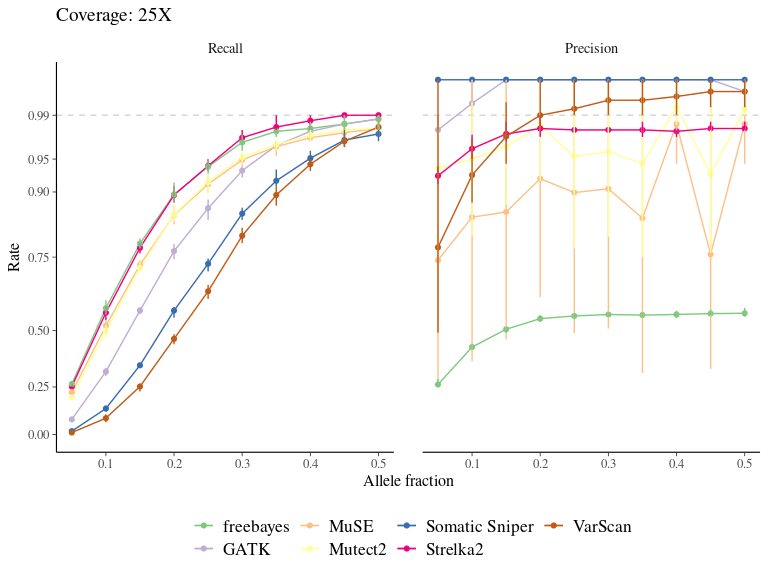

```{r setupmutationsinsilico, include=FALSE}
rm(list = ls()) ; invisible(gc()) ; set.seed(42)
library(knitr)
library(tidyverse)
theme_set(bayesplot::theme_default())
opts_chunk$set(
  echo = F, message = F, warning = F, fig.height = 6, fig.width = 8,
  cache = T, cache.lazy = F)
```

```{r datamutationsinsilico}
stats <- read_tsv("data/mutations/insilico/stats.experiment4.tsv") %>% 
  group_by(caller, N, R, AF, C) %>% 
  summarise_at(c("FN", "FP", "TP", "Precision", "Recall"), mean, na.rm = T) %>% 
  mutate(caller = recode(caller,    
                         "mutect2" = "Mutect2", 
                         "freebayes" = "freebayes", 
                         "gatk" = "GATK", 
                         "strelka2" = "Strelka2", 
                         "somaticsniper" = "Somatic Sniper", 
                         "muse" = "MuSE",
                         "varscan" = "VarScan"
  )) %>% 
  ungroup()
```
# Mutations *in silico*

This chapter described the *in silico* experiment using the [generateMutations](https://github.com/sylvainschmitt/generateMutations) and the [detectMutations](https://github.com/sylvainschmitt/detectMutations) workflows to test the effect of coverage/sequencing depth and allelic frequency on the performance of 7 tools to detect mutations either generalist or specific to mutations. Report to the published manuscript: https://peercommunityjournal.org/articles/10.24072/pcjournal.187/

```{r mutissf1, fig.cap="Performance of mutation detection tools  with allelic fraction and coverage. The inferno, black to yellow, colour scale indicates the recall and the precision rates for each tool to detect mutations."}
stats %>% 
  # mutate(Precision = ifelse(is.na(Precision), 0, Precision)) %>% 
  reshape2::melt(c("caller", "N", "R", "AF", "C"),
                 variable.name = "metric", value.name = "metric.value") %>% 
  filter(metric %in% c("Precision", "Recall")) %>% 
  mutate(metric = factor(metric, level = c("Recall", "Precision"))) %>% 
  ggplot(aes(AF, C, fill = metric.value)) +
  geom_tile() +
  facet_grid(caller ~ metric) +
  viridis::scale_fill_viridis("", option = "inferno") +
  xlab("Allele Fraction") + ylab("Coverage") +
  theme(strip.text.y = element_text(angle = 0),
        legend.position = "bottom",
        legend.key.width = unit(40, "points"))
```

```{r mutissf2, fig.cap="Best performing mutation detection tools depending on allelic fraction and coverage. The best performing tools were defined on the best recall rate first and best precision rate second for precision rates above 0.9. The labels in white indicate the recall rate (R) and the precision rate (P) for the best performing tools."}
stats %>%
  mutate(Precision = round(TP/(TP+FP), 4), Recall = round(TP/(TP+FN), 4)) %>% 
  filter(Precision > 0.9) %>% 
  group_by(AF, C) %>% 
  filter(Recall == max(Recall)) %>% 
  filter(Precision == max(Precision)) %>% 
  group_by(AF, C, Precision, Recall) %>% 
  summarise(caller = paste(unique(caller), sep = ", ", collapse = ", ")) %>% 
  ggplot(aes(AF, C)) +
  geom_tile(aes(fill = caller, alpha = Recall)) +
  geom_text(aes(label = round(Recall, 3)), col = "black", size	= 3) +
  scale_fill_brewer("", palette = "Accent") +
  theme(legend.position = "bottom") +
  xlab("Allele Fraction") + ylab("Coverage") +
  theme(strip.text.y = element_text(angle = 0),
        legend.position = "bottom") +
  scale_alpha_continuous(guide = "none")
```

```{r mutissf3, fig.cap="Variation in the performance of mutation detection tools with varying biological and sequencing parameters. The recall and the precision rates have been assessed for each tool to detect mutations with varying transition/transversion ratio, allelic fraction, and coverage. Tools to detect mutations include freebayes (red), MuSE (light green), Somatic Sniper (light blue), VarScan (pink), GATK (orange), Mutect2 (dark green), and Strelka2 (purple)."}
stats %>% 
    mutate(caller = recode(caller,    
                         "mutect2" = "Mutect2", 
                         "freebayes" = "freebayes", 
                         "gatk" = "GATK", 
                         "strelka2" = "Strelka2", 
                         "somaticsniper" = "Somatic Sniper", 
                         "muse" = "MuSE",
                         "varscan" = "VarScan"
  )) %>% 
  reshape2::melt(c("caller", "FN", "FP", "TP", "Precision", "Recall"),
                 variable.name = "parameter", value.name = "parameter.value") %>% 
  reshape2::melt(c("caller", "parameter", "parameter.value"),
                 variable.name = "metric", value.name = "metric.value") %>% 
  filter(metric %in% c("Precision", "Recall")) %>% 
  filter(parameter != "N") %>% 
  mutate(parameter = recode(parameter, "N" = "Number\nof mutations", "R" = "Transition\nTransversion Ratio",
                            "AF" = "Allele\nFrequency", "C" = "Coverage")) %>% 
  ggplot(aes(as.factor(parameter.value), metric.value, col = caller, fill = caller)) +
  geom_boxplot(alpha = 0.3) +
  facet_grid(metric ~ parameter, scales = "free") +
  theme(legend.position = "bottom", axis.title = element_blank()) +
  scale_color_discrete("") +
  scale_fill_discrete("")
```

```{r mutissf4, fig.cap="Variation in the performance of mutation detection tools with varying biological and sequencing parameters. The recall and the precision rates have been assessed for each tool to detect mutations with varying transition/transversion ratio, allelic fraction, and coverage."}
read_tsv("data/mutations/insilico/stats.experiment4.tsv") %>% 
      mutate(type = recode(caller,    
                         "mutect2" = "Cancer caller", 
                         "freebayes" = "SNP caller", 
                         "gatk" = "SNP caller", 
                         "strelka2" = "Cancer caller",
                         "somaticsniper" = "Cancer caller",
                         "muse" = "Cancer caller",
                         "varscan" = "Cancer caller"
  )) %>% 
    mutate(caller = recode(caller,    
                         "mutect2" = "Mutect2", 
                         "freebayes" = "freebayes", 
                         "gatk" = "GATK", 
                         "strelka2" = "Strelka2", 
                         "somaticsniper" = "Somatic Sniper", 
                         "muse" = "MuSE",
                         "varscan" = "VarScan"
  )) %>% 
  filter(C %in% c(25, 75, 150)) %>% 
  mutate(C = paste0(C, "X")) %>% 
  mutate(C = factor(C, levels = c("25X", "75X", "150X"))) %>% 
  dplyr::select(type, caller, C, AF, Recall, Precision) %>% 
  reshape2::melt(c("type", "caller", "C", "AF")) %>% 
  group_by(type, caller, C, AF, variable) %>% 
  na.omit() %>% 
  summarise(m = median(value), ll = min(value, na.rm = T), hh = max(value, na.rm = T)) %>% 
  ggplot(aes(x = AF, col = caller, fill = caller)) +
  geom_ribbon(aes(ymin = ll, ymax = hh), alpha = 0.3, col = NA) +
  geom_line(aes(y = m, linetype = type)) +
  geom_point(aes(y = m), alpha = 0.5) +
  facet_grid(C ~ variable) +
  xlab("Allele frequency") +
  ylab("") +
  scale_color_brewer("", palette = "Paired") +
  scale_fill_brewer("", palette = "Paired") +
  theme(legend.position = "bottom") +
  scale_linetype_manual("", values = c("dashed", "solid"), guide = guide_legend(nrow = 2))
```

```{r, eval=F}
stat0 <- read_tsv("data/mutations/insilico/stats.experiment4.tsv") %>% 
    mutate(caller = recode(caller,    
                         "mutect2" = "Mutect2", 
                         "freebayes" = "freebayes", 
                         "gatk" = "GATK", 
                         "strelka2" = "Strelka2", 
                         "somaticsniper" = "Somatic Sniper", 
                         "muse" = "MuSE",
                         "varscan" = "VarScan"
  )) %>% 
  filter(C %in% c(25, 75, 150)) %>% 
  mutate(C = paste0(C, "X")) %>% 
  mutate(C = factor(C, levels = c("25X", "75X", "150X"))) %>% 
  dplyr::select(caller, C, AF, Recall, Precision) %>% 
  reshape2::melt(c("caller", "C", "AF")) %>% 
  group_by(caller, C, AF, variable) %>% 
  summarise(m0 = median(value))
stat1 <- read_tsv("data/mutations/insilico/stats.tsv") %>% 
  dplyr::select(-mutationsfile) %>% 
  mutate(callfile = gsub("results/mutations/N1000_R2_", "", callfile)) %>% 
  mutate(callfile = gsub(".vcf", "", callfile)) %>% 
  separate(callfile, c("AF", "NR", "REP", "caller"), "_") %>% 
  mutate(AF = as.numeric(gsub("AF", "", AF))) %>% 
  mutate(NR = as.character(gsub("NR", "", NR))) %>% 
  mutate(REP = as.numeric(gsub("REP", "", REP))) %>% 
  mutate(C = recode(NR, "166667" = "25X", "500000" = "75X", "1000000" = "150X")) %>% 
  mutate(C = factor(C, levels = c("25X", "75X", "150X"))) %>%
    mutate(caller = recode(caller,    
                         "mutect2" = "Mutect2", 
                         "freebayes" = "freebayes", 
                         "gatk" = "GATK", 
                         "strelka2" = "Strelka2", 
                         "somaticsniper" = "Somatic Sniper", 
                         "muse" = "MuSE",
                         "varscan" = "VarScan"
  )) %>% 
  dplyr::select(caller, C, AF, Recall, Precision) %>% 
  reshape2::melt(c("caller", "C", "AF")) %>% 
  group_by(caller, C, AF, variable) %>% 
  na.omit() %>% 
  summarise(m1 = median(value))
stat_cor <- left_join(stat0, stat1)
cor.test(filter(stat_cor, variable == "Recall")$m0, filter(stat_cor, variable == "Recall")$m1)
cor.test(filter(stat_cor, variable == "Precision")$m0, filter(stat_cor, variable == "Precision")$m1)

stat_cor %>% 
  group_by(caller, variable) %>% 
  do(cor.test(.$m0, .$m1) %>% broom::tidy()) %>% 
  na.omit() %>% 
  reshape2::dcast(caller ~ variable, value.var = "estimate")
```

```{r mutissf5, fig.cap="Variation in the performance of mutation detection tools with varying biological and sequencing parameters. The recall and the precision rates have been assessed for each tool to detect mutations with varying transition/transversion ratio, allelic fraction, and coverage."}
rev_sqrt_trans <- function() {
    scales::trans_new(
        name = "rev_sqrt", 
        transform = function(x) -sqrt(1-x), 
        inverse = function(x) 1-x^2);
}
data <- read_tsv("data/mutations/insilico/stats.experiment4.tsv") %>% 
    mutate(caller = recode(caller,    
                         "mutect2" = "Mutect2", 
                         "freebayes" = "freebayes", 
                         "gatk" = "GATK", 
                         "strelka2" = "Strelka2", 
                         "somaticsniper" = "Somatic Sniper", 
                         "muse" = "MuSE",
                         "varscan" = "VarScan"
  )) %>% 
   mutate(C = paste0(C, "X")) %>% 
  mutate(C = factor(C, levels = c("25X", "50X", "75X", "100X",
                                  "125X", "150X", "175X", "200X"))) %>% 
  group_by(caller, C, AF) %>% 
  na.omit() %>% 
  summarize(m = mean(Recall), q5 = quantile(Recall, 0.05), q95 = quantile(Recall, 0.95), p = mean(Precision))
g <- data %>% 
  ggplot(aes(x = AF, col = caller)) +
  geom_hline(yintercept = 0.99, linetype = "dashed", col = "lightgrey") +
  geom_line(aes(y = m)) +
  geom_segment(aes(y = q5, yend = q95, xend = AF)) +
  geom_point(aes(y = m, shape = p > 0.9), size = 2) +
  facet_wrap(~ C, ncol = 4) + 
  scale_y_continuous(trans = "rev_sqrt", breaks = c(0, 0.25, 0.5, 0.75, 0.9, 0.95, 0.99, 1)) +
  scale_color_manual(guide = "none", values = RColorBrewer::brewer.pal(7, "Accent")) +
  xlab("Allele fraction") + ylab("Recall") +
  scale_shape_manual(guide = "none", values = c(1, 16)) 

g1 <- filter(data, caller %in% c("freebayes", "GATK", "VarScan")) %>% 
  ggplot(aes(x = AF, col = caller)) +
  geom_hline(yintercept = 0.99, linetype = "dashed", col = "lightgrey") +
  geom_line(aes(y = m)) +
  geom_point(aes(y = m)) +
  geom_segment(aes(y = q5, yend = q95, xend = AF)) +
  facet_wrap(~ C, ncol = 4) + 
  scale_y_continuous(trans = "rev_sqrt", breaks = c(0, 0.25, 0.5, 0.75, 0.9, 0.95, 0.99, 1)) +
  scale_size_continuous(range = c(0.1, 1)) +
  scale_color_manual("SNP callers", values = RColorBrewer::brewer.pal(7, "Accent")[c(1,2,7)]) +
  theme(legend.position = "bottom") +
  xlab("Allele fraction") + ylab("Recall")
l1 <- cowplot::get_legend(g1)

g2 <- filter(data, !(caller %in% c("freebayes", "GATK", "VarScan"))) %>% 
  ggplot(aes(x = AF, col = caller)) +
  geom_hline(yintercept = 0.99, linetype = "dashed", col = "lightgrey") +
  geom_line(aes(y = m)) +
  geom_point(aes(y = m)) +
  geom_segment(aes(y = q5, yend = q95, xend = AF)) +
  facet_wrap(~ C, ncol = 4) + 
  scale_y_continuous(trans = "rev_sqrt", breaks = c(0, 0.25, 0.5, 0.75, 0.9, 0.95, 0.99, 1)) +
  scale_size_continuous(range = c(0.1, 1)) +
  scale_color_manual("Cancer callers", values = RColorBrewer::brewer.pal(7, "Accent")[3:6]) +
  theme(legend.position = "bottom") +
  xlab("Allele fraction") + ylab("Recall")
l2 <- cowplot::get_legend(g2)

cowplot::plot_grid(g, l1, l2, nrow = 3, rel_heights = c(8,1,1))
```

```{r}
library(gganimate)
rev_sqrt_trans <- function() {
    scales::trans_new(
        name = "rev_sqrt", 
        transform = function(x) -sqrt(1-x), 
        inverse = function(x) 1-x^2);
}
g <- read_tsv("data/mutations/insilico/stats.experiment4.tsv") %>% 
    mutate(caller = recode(caller,    
                         "mutect2" = "Mutect2", 
                         "freebayes" = "freebayes", 
                         "gatk" = "GATK", 
                         "strelka2" = "Strelka2", 
                         "somaticsniper" = "Somatic Sniper", 
                         "muse" = "MuSE",
                         "varscan" = "VarScan"
  )) %>% 
   mutate(C = paste0(C, "X")) %>% 
  mutate(C = factor(C, levels = c("25X", "50X", "75X", "100X",
                                  "125X", "150X", "175X", "200X"))) %>% 
  dplyr::select(caller, C, AF, Recall, Precision) %>% 
  reshape2::melt(c("caller", "C", "AF")) %>% 
  group_by(caller, C, AF, variable) %>% 
  na.omit() %>% 
  summarize(m = mean(value), q5 = quantile(value, 0.05), q95 = quantile(value, 0.95)) %>% 
  ggplot(aes(x = AF, col = caller)) +
  geom_hline(yintercept = 0.99, linetype = "dashed", col = "lightgrey") +
  geom_line(aes(y = m)) +
  geom_point(aes(y = m)) +
  geom_segment(aes(y = q5, yend = q95, xend = AF)) +
  facet_wrap(~ variable, nrow = 1) + 
  scale_y_continuous(trans = "rev_sqrt", breaks = c(0, 0.25, 0.5, 0.75, 0.9, 0.95, 0.99, 1)) +
  scale_size_continuous(range = c(0.1, 1)) +
  scale_color_manual("", values = RColorBrewer::brewer.pal(7, "Accent")) +
  xlab("Allele fraction") + ylab("Rate") +
  transition_manual(C) +
  labs(title = 'Coverage: {current_frame}') +
  theme(legend.position = "bottom")
anim_save("save/insilico.gif", g, renderer = gifski_renderer())
```


```{r mutissf5.2, fig.cap="Variation in the performance of mutation detection tools with varying biological and sequencing parameters. The recall and the precision rates have been assessed for each tool to detect mutations with varying transition/transversion ratio, allelic fraction, and coverage."}

```

```{r mutissf5.3, fig.cap="Variation in the performance of mutation detection tools with varying biological and sequencing parameters. The recall and the precision rates have been assessed for each tool to detect mutations with varying transition/transversion ratio, allelic fraction, and coverage.", fig.height = 7, fig.width = 7}
rev_sqrt_trans <- function() {
    scales::trans_new(
        name = "rev_sqrt", 
        transform = function(x) -sqrt(1-x), 
        inverse = function(x) 1-x^2);
}
data <- read_tsv("data/mutations/insilico/stats.experiment4.tsv") %>% 
    mutate(caller = recode(caller,    
                         "mutect2" = "Mutect2", 
                         "freebayes" = "freebayes", 
                         "gatk" = "GATK", 
                         "strelka2" = "Strelka2", 
                         "somaticsniper" = "Somatic Sniper", 
                         "muse" = "MuSE",
                         "varscan" = "VarScan"
  )) %>% 
   mutate(C = paste0(C, "X")) %>% 
  mutate(C = factor(C, levels = c("25X", "50X", "75X", "100X",
                                  "125X", "150X", "175X", "200X"))) %>% 
  filter(C %in% c("25X", "75X", "200X")) %>% 
  group_by(caller, C, AF) %>% 
  na.omit() %>% 
  dplyr::select(caller, AF, C, Precision, Recall) %>% 
  reshape2::melt(c("caller", "AF", "C")) %>% 
  mutate(variable = factor(variable, levels = c("Recall", "Precision"))) %>% 
  group_by(caller, AF, C, variable) %>% 
  # summarize(m = mean(value), q5 = quantile(value, 0.05), q95 = quantile(value, 0.95))
  summarize(m = mean(value), q5 = mean(value)-sd(value), q95 = mean(value)+sd(value))
g <- data %>% 
  ggplot(aes(x = AF, col = caller)) +
  geom_hline(yintercept = 0.99, linetype = "dashed", col = "lightgrey") +
  geom_line(aes(y = m)) +
  geom_segment(aes(y = q5, yend = q95, xend = AF)) +
  geom_point(aes(y = m), size = 2) +
  facet_grid(C ~ variable) + 
  scale_y_continuous(trans = "rev_sqrt", breaks = c(0, 0.25, 0.5, 0.75, 0.9, 0.95, 0.99, 1)) +
  scale_color_manual(guide = "none", values = RColorBrewer::brewer.pal(7, "Accent")) +
  xlab("Allele fraction") + ylab("Rate")

g1 <- filter(data, caller %in% c("freebayes", "GATK", "VarScan")) %>% 
  ggplot(aes(x = AF, col = caller)) +
  geom_hline(yintercept = 0.99, linetype = "dashed", col = "lightgrey") +
  geom_line(aes(y = m)) +
  geom_segment(aes(y = q5, yend = q95, xend = AF)) +
  geom_point(aes(y = m), size = 2) +
  facet_grid(C ~ variable) + 
  scale_y_continuous(trans = "rev_sqrt", breaks = c(0, 0.25, 0.5, 0.75, 0.9, 0.95, 0.99, 1)) +
  scale_color_manual("Generic callers", values = RColorBrewer::brewer.pal(7, "Accent")[c(1,2,7)]) +
  xlab("Allele fraction") + ylab("Rate") +
  theme(legend.position = "bottom")
l1 <- cowplot::get_legend(g1)

g2 <- filter(data, !(caller %in% c("freebayes", "GATK", "VarScan"))) %>% 
   ggplot(aes(x = AF, col = caller)) +
  geom_hline(yintercept = 0.99, linetype = "dashed", col = "lightgrey") +
  geom_line(aes(y = m)) +
  geom_segment(aes(y = q5, yend = q95, xend = AF)) +
  geom_point(aes(y = m), size = 2) +
  facet_grid(C ~ variable) + 
  scale_y_continuous(trans = "rev_sqrt", breaks = c(0, 0.25, 0.5, 0.75, 0.9, 0.95, 0.99, 1)) +
  scale_color_manual("Mutation-specific callers", values = RColorBrewer::brewer.pal(7, "Accent")[3:6]) +
  xlab("Allele fraction") + ylab("Rate") +
  theme(legend.position = "bottom")
l2 <- cowplot::get_legend(g2)

cowplot::plot_grid(g, l1, l2, nrow = 3, rel_heights = c(8,1,1))
```

```{r mutissf5.4, fig.cap="Variation in the performance of mutation detection tools with varying biological and sequencing parameters. The recall and the precision rates have been assessed for each tool to detect mutations with varying transition/transversion ratio, allelic fraction, and coverage.", fig.height = 10, fig.width = 7}
rev_sqrt_trans <- function() {
    scales::trans_new(
        name = "rev_sqrt", 
        transform = function(x) -sqrt(1-x), 
        inverse = function(x) 1-x^2);
}
data <- read_tsv("data/mutations/insilico/stats.experiment4.tsv") %>% 
    mutate(caller = recode(caller,    
                         "mutect2" = "Mutect2", 
                         "freebayes" = "freebayes", 
                         "gatk" = "GATK", 
                         "strelka2" = "Strelka2", 
                         "somaticsniper" = "Somatic Sniper", 
                         "muse" = "MuSE",
                         "varscan" = "VarScan"
  )) %>% 
   mutate(C = paste0(C, "X")) %>% 
  mutate(C = factor(C, levels = c("25X", "50X", "75X", "100X",
                                  "125X", "150X", "175X", "200X"))) %>% 
  group_by(caller, C, AF) %>% 
  na.omit() %>% 
  dplyr::select(caller, AF, C, Precision, Recall) %>% 
  reshape2::melt(c("caller", "AF", "C")) %>% 
  mutate(variable = factor(variable, levels = c("Recall", "Precision"))) %>% 
  group_by(caller, AF, C, variable) %>% 
  # summarize(m = mean(value), q5 = quantile(value, 0.05), q95 = quantile(value, 0.95))
  summarize(m = mean(value), q5 = mean(value)-sd(value), q95 = mean(value)+sd(value))
g <- data %>% 
  ggplot(aes(x = AF, col = caller)) +
  geom_hline(yintercept = 0.99, linetype = "dashed", col = "lightgrey") +
  geom_line(aes(y = m)) +
  geom_segment(aes(y = q5, yend = q95, xend = AF)) +
  geom_point(aes(y = m), size = 2) +
  facet_grid(C ~ variable) + 
  scale_y_continuous(trans = "rev_sqrt", breaks = c(0, 0.25, 0.5, 0.75, 0.9, 0.95, 0.99, 1)) +
  scale_color_manual(guide = "none", values = RColorBrewer::brewer.pal(7, "Accent")) +
  xlab("Allele fraction") + ylab("Rate")

g1 <- filter(data, caller %in% c("freebayes", "GATK", "VarScan")) %>% 
  ggplot(aes(x = AF, col = caller)) +
  geom_hline(yintercept = 0.99, linetype = "dashed", col = "lightgrey") +
  geom_line(aes(y = m)) +
  geom_segment(aes(y = q5, yend = q95, xend = AF)) +
  geom_point(aes(y = m), size = 2) +
  facet_grid(C ~ variable) + 
  scale_y_continuous(trans = "rev_sqrt", breaks = c(0, 0.25, 0.5, 0.75, 0.9, 0.95, 0.99, 1)) +
  scale_color_manual("SNP callers", values = RColorBrewer::brewer.pal(7, "Accent")[c(1,2,7)]) +
  xlab("Allele fraction") + ylab("Rate") +
  theme(legend.position = "bottom")
l1 <- cowplot::get_legend(g1)

g2 <- filter(data, !(caller %in% c("freebayes", "GATK", "VarScan"))) %>% 
   ggplot(aes(x = AF, col = caller)) +
  geom_hline(yintercept = 0.99, linetype = "dashed", col = "lightgrey") +
  geom_line(aes(y = m)) +
  geom_segment(aes(y = q5, yend = q95, xend = AF)) +
  geom_point(aes(y = m), size = 2) +
  facet_grid(C ~ variable) + 
  scale_y_continuous(trans = "rev_sqrt", breaks = c(0, 0.25, 0.5, 0.75, 0.9, 0.95, 0.99, 1)) +
  scale_color_manual("Cancer callers", values = RColorBrewer::brewer.pal(7, "Accent")[3:6]) +
  xlab("Allele fraction") + ylab("Rate") +
  theme(legend.position = "bottom")
l2 <- cowplot::get_legend(g2)

cowplot::plot_grid(g, l1, l2, nrow = 3, rel_heights = c(10,1,1))
```

```{r}
read_tsv("data/mutations/insilico/benchmarks.tsv") %>% 
  separate(file, c("toola", "toolb")) %>% 
  mutate(tool = paste(toola, toolb)) %>% 
  group_by(tool) %>% 
  mutate(tool = recode(tool,    
                       "gatk mutect2" = "Mutect2", 
                       "freebayes" = "freebayes", 
                       "gatk genotypegvcfs" = "GATK GenotypeGVCFs", 
                       "gatk haplotypecaller" = "GATK HaplotypeCaller", 
                       "strelka2 N1000" = "Strelka2", 
                       "somaticsniper N1000" = "Somatic Sniper", 
                       "muse N1000" = "MuSE",
                       "varscan N1000" = "VarScan"
  )) %>% 
  filter(tool %in% c("Mutect2", "freebayes", "GATK GenotypeGVCFs", "GATK HaplotypeCaller", 
                      "Strelka2", "Somatic Sniper",  "MuSE", "VarScan")) %>% 
  mutate(s = lubridate::as_datetime(s)) %>% 
  group_by(tool) %>% 
  ggplot(aes(tool, s)) +
  geom_boxplot() +
  coord_flip() +
  xlab("") + ylab("Duration (mm:ss)")
```


```{r, eval=F}
read_tsv("data/mutations/insilico/stats.experiment4.tsv") %>% 
    mutate(caller = recode(caller,    
                         "mutect2" = "Mutect 2", 
                         "freebayes" = "freebayes", 
                         "gatk" = "GATK", 
                         "strelka2" = "Strelka 2", 
                         "somaticsniper" = "Somatic Sniper", 
                         "muse" = "MuSE",
                         "varscan" = "VarScan"
  )) %>% 
  group_by(caller) %>% 
  summarise(Rm = mean(Recall, na.rm = T), Rs = sd(Recall, na.rm = T),
            Pm = mean(Precision, na.rm = T), Ps = sd(Precision, na.rm = T)) %>% 
  mutate(Recall = paste0(round(Rm, 2), " (", round(Rs, 2), ")" ), 
         Precision = paste0(round(Pm, 2), " (", round(Ps, 2), ")" )) %>% 
  dplyr::rename(Caller = caller) %>% 
  dplyr::select(Caller, Recall, Precision) %>% 
  write_tsv("save/insilico_mean.tsv")
```

```{r, eval=F}
read_tsv("data/mutations/insilico/stats.experiment4.tsv") %>% 
    mutate(caller = recode(caller,    
                         "mutect2" = "Mutect 2", 
                         "freebayes" = "freebayes", 
                         "gatk" = "GATK", 
                         "strelka2" = "Strelka 2", 
                         "somaticsniper" = "Somatic Sniper", 
                         "muse" = "MuSE",
                         "varscan" = "VarScan"
  )) %>% 
  group_by(caller, R, AF, C) %>% 
  summarise(Rm = mean(Recall, na.rm = T), Rs = sd(Recall, na.rm = T),
            Pm = mean(Precision, na.rm = T), Ps = sd(Precision, na.rm = T)) %>% 
  mutate(Recall = paste0(round(Rm, 2), " (", round(Rs, 2), ")" ), 
         Precision = paste0(round(Pm, 2), " (", round(Ps, 2), ")" )) %>% 
  dplyr::rename(Caller = caller, `Allelic Frequency` = AF, Coverage = C) %>% 
  dplyr::select(Caller, `Allelic Frequency`, Coverage, Recall, Precision) %>% 
  write_tsv("save/insilico_all.tsv")
```
```{r , eval=F}
read_tsv("data/mutations/insilico/stats.experiment4.tsv") %>% 
    mutate(caller = recode(caller,    
                         "mutect2" = "Mutect2", 
                         "freebayes" = "freebayes", 
                         "gatk" = "GATK", 
                         "strelka2" = "Strelka2", 
                         "somaticsniper" = "Somatic Sniper", 
                         "muse" = "MuSE",
                         "varscan" = "VarScan"
  )) %>% 
   mutate(C = paste0(C, "X")) %>% 
  mutate(C = factor(C, levels = c("25X", "50X", "75X", "100X",
                                  "125X", "150X", "175X", "200X"))) %>% 
  group_by(caller, C, AF) %>% 
  na.omit() %>% 
  dplyr::select(caller, AF, C, Precision, Recall) %>% 
  reshape2::melt(c("caller", "AF", "C")) %>% 
  mutate(variable = factor(variable, levels = c("Recall", "Precision"))) %>% 
  group_by(caller, AF, C, variable) %>% 
  summarize(m = mean(value), q5 = mean(value)-sd(value), q95 = mean(value)+sd(value)) %>% 
  filter(caller == "Strelka2", C %in% c("75X", "150X")) %>% 
  mutate(AF = ifelse(C == "75X", AF/2, AF)) %>% 
  ggplot(aes(x = AF, col = C)) +
  geom_hline(yintercept = 0.99, linetype = "dashed", col = "lightgrey") +
  geom_line(aes(y = m)) +
  geom_segment(aes(y = q5, yend = q95, xend = AF)) +
  geom_point(aes(y = m), size = 2) +
  facet_wrap(~ variable) + 
  scale_color_manual(values = RColorBrewer::brewer.pal(7, "Accent")) +
  xlab("Allele fraction") + ylab("Rate")
```